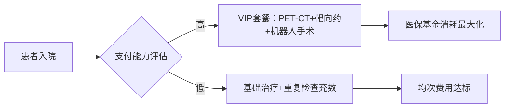



## 刘翔峰案17年重判背后：医疗产业化困局与三明医改破局之路

> 当白大褂沾染血污，手术刀沦为提款机，我们被迫直视一个被产业化思维蛀空的医疗体系。

2024年10月31日，长沙市中级人民法院。站在被告席上的刘翔峰已不见昔日湘雅二院副主任医师的意气风发。法官宣读判决书的声音冰冷而清晰：**有期徒刑十七年，罚金四十二万元**。

这位曾被誉为“肝胆胰外科专家”的医生，因**故意伤害、受贿、职务侵占**等罪名被钉在医疗史的耻辱柱上。

法院查明的事实令人胆寒：他单独或伙同他人**夸大患者病情、虚构病征，给6名不具备手术指征的患者实施手术**，致5人重伤、九级伤残，1人轻伤。

---

### 01 黑医之罪：刘翔峰事件的医疗信任崩塌

刘翔峰案件撕开了医疗体系最隐秘的创口。这位从医20年的普外肝胆胰专科副主任医师，在湘雅二院急诊外科和湖南省创伤急救中心副主任的职位掩护下，编织了一张**以患者健康换取金钱**的利益网。

他的医疗行为已超出单纯的过失范畴，演变为系统性的职业犯罪：

- **器官掠夺者**：在手术中擅自切除患者健康的脾脏、胰脏等器官，通过地下渠道转卖。部分患者因器官缺失导致并发症甚至死亡。
- **肛门摧毁者**：对一位肿瘤距肛门12厘米的直肠癌患者，**强行实施永久性造瘘手术**，而上海医生明确告知可保肛。
- **辐射投毒者**：在甲状腺癌患者体内违规埋入21颗放射性粒子，无视医学指南警告的二次肿瘤风险。
- **化疗滥用者**：对术后患者实施超剂量化疗致其进ICU，剂量错误的外科化疗已成“公开的秘密”。

更令人窒息的是其作案手法：专门选择“**没有文化的农民工**”作为目标，利用患者医学知识匮乏和维权能力薄弱的特点实施侵害。

中纪委在案发后提出三个锥心之问：为何内部没有早发现？医院管理是否有漏洞？日常监管是否到位？ 这些问题直指医疗体系的系统性溃败。

---

### 02 体系之殇：为什么黑医不是孤例？

刘翔峰能在十余年间持续作恶而不被制止，暴露出**医疗体系存在深层次结构性问题**。当医疗产业化成为主导逻辑，“手术刀”与“提成单”的捆绑便成为必然。

#### 利益驱动下的集体沉默

- **科室利益共同体**：医疗产业化使“**一切考核以是否赚钱为基础**”，当医生在“对病人好”和“让科室医院赚钱”间选择时，群体压力使人性扭曲。有同行坦言：“同事们认为你对病人太好就是圣母，会讥讽你恶心”。
- **绝对权力机制**：高级职称医生独立带组后，**对治疗方案拥有绝对话语权**。组内医生必须执行上级指令，即使明知方案错误。这种“医疗霸权”使监督机制形同虚设。

#### 产业化催生的畸形生态

- **癌症经济学**：某些肿瘤医院设有“**患者家境情报人员**”，专门分析患者支付能力，力求刮走最多的钱。癌症患者成为“理想猎物”——治疗失败可归咎于疾病本身。
- **技术滥用链**：当达芬奇机器人手术、化疗泵植入等高价技术遇灰色回扣，适应症标准便被轻易突破。刘翔峰案中虚构病情实施的机器人手术，揭开了技术崇拜面具下的利益本质。

> 一位医疗观察者尖锐指出：“中国的公立医院本应是人民医院，服务人民，而非把人民拉进去兑换人民币”。

---

### 03 产业化迷途：当治病救人变为利润创造

医疗产业化的根本问题在于将**经济收益确立为医疗行为的核心KPI**。这种导向催生了“医院越盖越大越豪华”的怪象，却与医疗本质渐行渐远。

#### 金钱逻辑对医德的侵蚀
当医生薪酬与科室收益挂钩，“**我明知道我治不好你，但你找我治我就给你治**”成为潜规则。北京某三甲医院博士在访谈中坦言：“**患者越相信你，就越容易被利用**，医保资金成为待宰羔羊”。

#### 全球困境与中国特色
美国医疗支出占GDP近20%，却仍未解决公平性问题。中国在医改深水区面临独特挑战：**既需防止美国式资本垄断，又要破解“以药养医”的历史积弊**。

2025年2月，一位常规体检被误诊为“肝占位”的长沙张先生，经历了胆囊切除、化疗泵植入等过度治疗，最终被鉴定为九级伤残。法院突破性地将诉讼时效起算点定为2022年刘翔峰案发时，判决医院赔偿57万元。

此案揭示：**在产业化医疗体系下，没有患者能真正逃脱伤害**。

---

### 04 重构之路：三明医改的曙光与挑战

当刘翔峰在监狱中开始服刑时，千里之外的湖北宜昌正进行一场医疗体系的重构实验。2025年4月23日，国家卫健委在此宣布**以地市为单位全面推广三明医改经验**。

#### 湖北样本的破局之道
- **薪酬革命**：宜昌将**医生固定薪酬占比提至45%**，切断“开药养医”链条
- **药价腰斩**：通过集中采购使药品耗材**降价超50%**，CT检查费**下降26.8%**
- **数字赋能**：投入18.4亿元建健康医疗大数据中心，日均7000人次享受线上服务

#### 长三角的协同创新
2025年7月发布的《长三角区域卫生健康一体化发展三年行动计划》，试图通过**医疗技术同质化、检查结果互认、专科联盟建设**打破地域壁垒。

三省一市**推进出生“一件事”跨省通办**，将原本18天的流程压缩至5天，申请表由6份减至1份。这些改革直指过度医疗的命门——当检查结果全域互认，重复检查的创收模式便难以为继。

---

### 05 制度重构：迈向价值医疗的关键转折

2025年7月，**14部委联合发文**剑指医疗歪风，要求对违背医德、败坏医风行为“零容忍”。这份文件与刘翔峰案的判决形成制度重构的共振。

#### 监管革命
文件明确要**紧盯“关键少数”和关键岗位**，聚焦药品耗材招投标、样本外送、外配处方等腐败高发环节，建立行贿受贿“黑名单”制度。智能监管系统在十堰市已初显威力，**日均拦截异常诊疗行为超百例**。

#### 价值医疗新范式
三明医改启示：唯有**刀刃向内的利益重构**才能让医疗回归本质。其核心是建立三层防护网：
- **医生层面**：**薪酬透明化**，切断灰色收入
- **医院层面**：**债务化解+编制周转池**，解除创收压力
- **患者层面**：**分级诊疗+数字医疗**，构筑就医防线

当宜昌65%患者首选基层就诊，十堰县域内就诊率达90%时，过度医疗的生存空间正被逐步压缩。

---

### 06 道德与制度的平衡术

法律可以惩罚刘翔峰，却无法量化约束每个医生的道德选择。慈溪市近期处罚事件颇具象征意义：一位医生因“好心”为熟人**违规开具四个月病假条，被重罚一万元**。

此案揭示：**医疗行为必须遵循程序正义**，即使动机“善良”也不能逾越法律红线。

医疗改革的深层命题，在于平衡三大矛盾：**专业壁垒导致的监管失灵、创收压力引发的道德风险、维权成本高昂形成的救济障碍**。当湖北秭归县通过“一村一名大学生村医”计划使村医流失率下降70%，我们看到的不仅是待遇提升，更是医疗尊严的重建。

---

张先生拖着九级伤残的身体走出法院时，医疗信任危机的裂痕已深入社会肌理。这位因常规体检误诊而被错误切除胆囊、植入化疗泵的长沙市民，最终获得57万元赔偿，代价是永远失去健康。

他的遭遇与刘翔峰案共同构成**中国医疗改革的历史注脚**——当“公益性”被产业化思维稀释，患者与医生终将**共同承受体系异化的苦果**。

医疗体系重构的本质，是**将人民重新置于医疗服务的中心位置**。当三明医改使宜昌医生固定薪酬占比达45%，当长三角实现检查结果跨省互认，当14部委联合围剿医疗不正之风，制度的力量正在矫正扭曲的价值取向。

**医疗的尊严不在豪华大楼，而在每个医生拒绝过度医疗的勇气中；体系的重构不靠道德说教，而系于让好医生体面生活的制度设计里。**

## 医疗体系重构：当手术刀不再为资本跳舞  
——从刘翔峰案到三明医改的生死突围  

---

### 07 道德困境：白衣天使还是创收工具？  
倪萍访谈中的北大协和博士道破行业潜规则：**“患者越信任，越容易被榨取价值”**。当医生薪酬与科室收益深度捆绑，救死扶伤的圣殿便沦为算计人性的修罗场。  

#### 撕裂的职业人格  
- **双重生存逻辑**：一边是希波克拉底誓言，一边是科室创收指标。北京某三甲主治医师坦言：**“每月药占比超标扣3000元，但多开两套基因检测就能补回来”**  
- **结构性作恶**：武汉某医院设置“**医保额度消耗进度表**”，科室按完成率排名。当治病变成清库存，过度医疗成为生存刚需  

#### 沉默的大多数  
上海瑞金医院某副主任的辞职信刺痛行业：**“我不想再当高级医药代表”**。当正直医生因拒开回扣药被边缘化，当年轻医学生目睹导师月入百万豪宅——**道德坚守者反成体系异类**。  

> 一位匿名医生的灵魂拷问在医疗论坛疯传：**“如果诚实意味着孩子上不起学区房，我该不该给感冒患者开CT？”**  

---

### 08 全球痼疾：豪华医院背后的文明悖论  
当美国克利夫兰医学中心建成造价17亿美元的玻璃宫殿时，非洲孕妇正因缺5美元剖腹产费死亡。中国医疗产业化困境有着深刻的全球烙印：  

#### 技术崇拜的陷阱  
- **达芬奇机器人**：单台成本2000万元，每次开机费3万元。某省级医院为摊薄成本，将胆囊手术适应症放宽3倍  
- **质子治疗中心**：全国建成11个超十亿项目，多数年接诊不足百人。郑州某中心为创收，竟向早期肺癌患者推荐治疗  

#### 医保黑洞的扩张  
2024年全国医保基金支出增速是收入增速的2.3倍。某些医院的生存策略令人窒息：  

---

### 09 制度破壁：三明改革的基因重组  
当湖北宜昌将医生固定薪酬提至45%，神奇的变化发生了：某三甲医院骨科耗材使用量骤降38%，而患者满意度上升12个百分点。这场静默革命正在重构医疗DNA：  

#### 斩断利益黑链  
- **药品耗材“零差价”**：心脏支架从1.3万降至700元，医院反获150元/个政府补贴  
- **处方智能监控**：十堰系统实时拦截超常处方，某医生开“抗生素+益生菌”组合被当场警示  

#### 尊严医疗重建  
福建三明试点“**年薪制**”五年后：  
- 主任医师最高年薪58万，无需考虑科室收益  
- 基层就诊率从18%升至65%  
- 二甲双胍等常用药价格低于便利店  

> 曾怒斥“医生工资翻倍也改不了捞钱”的老教授，主动退回患者红包：“现在活得体面，不想脏了白大褂”  

---

### 10 未来医疗：在技术与人性的十字路口  
当AI诊断准确率超越人类医生，我们更需警惕算法霸权。浙江推行的“医共体”模式给出新答案：  

#### 数字赋能下的温度医疗  
- **云端健康管家**：绍兴张大爷的糖尿病数据实时传至市医院，AI预警并发症风险后，家庭医生2小时上门  
- **结果互认革命**：长三角41市检查报告互通，某患者省下重复CT费3860元  

#### 基层医疗觉醒  
贵州正安县“**AI村医**”打通最后一公里：  
- 可识别200种常见病的智能药箱进村  
- 5G远程B超使产妇死亡下降76%  
- 村医收入由签约家庭数量决定而非开药量  

---

### 11 生死之间：每个普通人的医疗保卫战  
当长沙张先生拿着57万赔偿金走出法院时，他的胆囊永远留在刘翔峰的手术盘中。这场悲剧启示我们：**患者觉醒是体系改革的终极动力**。  

#### 公民医疗素养革命  
- **知情权武器化**：学会询问“这个检查有指南依据吗？”  
- **第二意见制度化**：北京推行“重大手术双签制”，避免冲动医疗  

#### 社区医疗网络  
上海虹口街道的“**健康合伙人**”计划正在蔓延：  

---

## 结语：让医疗回归生命本质  
刘翔峰的十七年刑期可以画上句号，但中国医疗的救赎之路才刚刚启程。当我们看见：  
- 宜昌村医王琳拒开抗生素，改用艾灸治愈患儿获万元奖励  
- 杭州医保局凭AI分析追回过度医疗款4300万  
- 曾经的“回扣药王”企业转型研发平价抗癌药  

这些光亮照见医疗重构的核心真谛：  
> **真正的医疗进步不在大楼高度，而在医生挺直的脊梁；  
> 体系重构的成功标志，是患者走进医院时不再紧捂钱包的手**  

当三明春风吹过长江黄河，当医生的薪酬单不再印着药品提成代码，我们终将重逢希波克拉底誓言里的医学初心——那是白衣战士对生命最本真的虔诚。